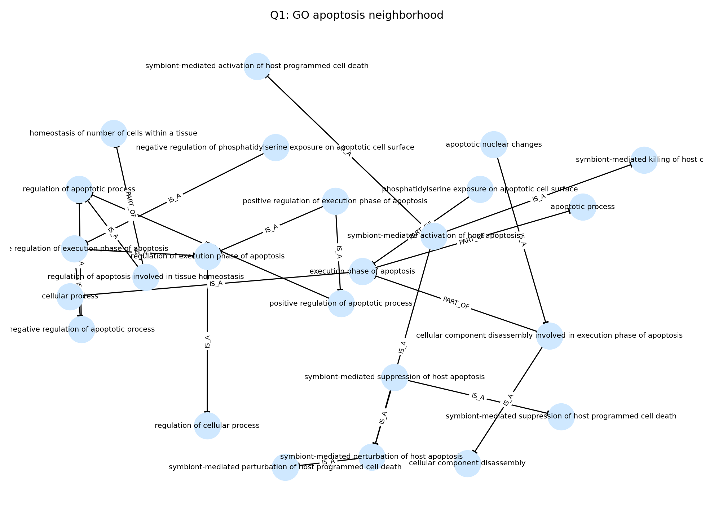
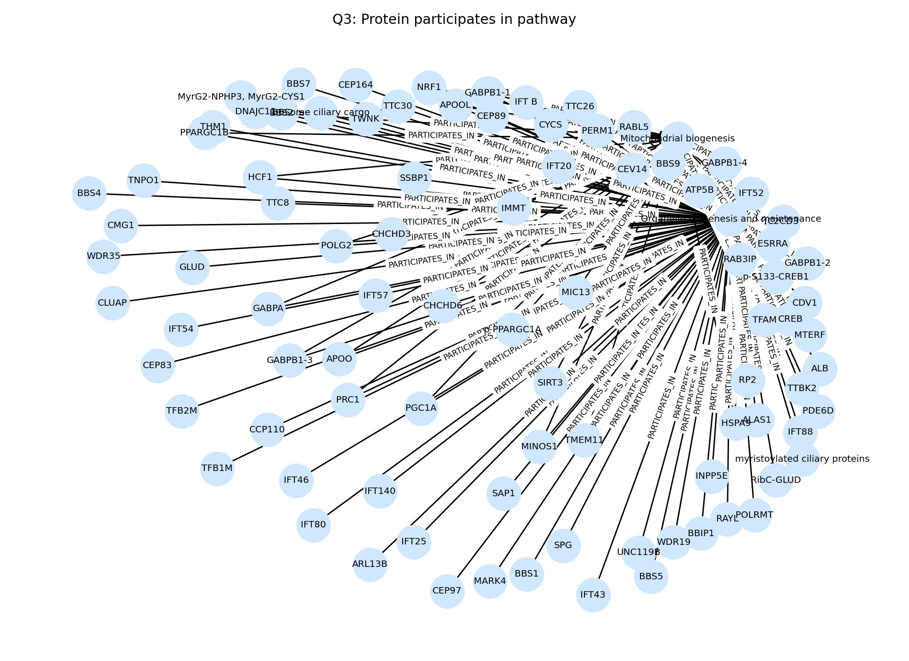
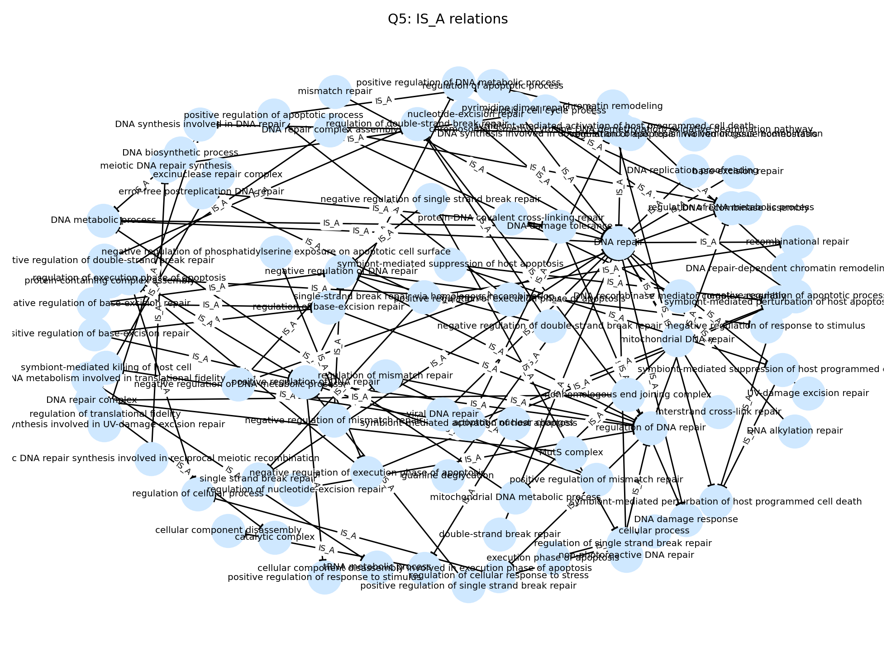

# SciGraphRAG

## Présentation

SciGraphRAG est une démonstration de graphe de connaissances biomédical centré sur l’interprétabilité. Le projet relie Gene Ontology et Reactome dans Neo4j afin de produire des requêtes explicables, des sous-graphes lisibles et des visualisations destinées à la consultation scientifique.

## Présentation du projet

Le projet construit un pipeline reproductible pour convertir des données OWL/BioPAX en un graphe Neo4j exploitable pour des usages de type GraphRAG. L’objectif n’est pas de fournir un produit applicatif, mais de montrer une chaîne complète d’ingestion, de modélisation, de requêtage et de visualisation adaptée à la recherche en bioinformatique.

## Motivation scientifique

L’annotation biologique est souvent dispersée entre ontologies, bases de voies et formats hétérogènes. SciGraphRAG vise à unifier ces sources dans un même graphe pour faciliter l’exploration explicable des processus biologiques, des protéines et des pathways. Cette approche met en valeur la capacité à relier des connaissances curatoriales publiques à des requêtes interprétables, ce qui est utile pour la recherche exploratoire, l’aide à l’hypothèse et la préparation d’un futur GraphRAG scientifique.

## Architecture du pipeline

Voir le schéma détaillé dans [docs/ARCHITECTURE.md](docs/ARCHITECTURE.md).

En résumé:
- Gene Ontology est parsé depuis OWL avec `rdflib`.
- Les relations sont extraites via `SPARQL`, puis importées dans `Neo4j`.
- Reactome est intégré au même graphe comme couche de voies biologiques (pathways) et de protéines.
- Les requêtes `Cypher` alimentent le notebook de démonstration et les visualisations.

## Quickstart (minimal)

1. Installer les dépendances:

```bash
pip install -r requirements.txt
```

2. Préparer les variables d'environnement:

```bash
cp .env.example .env
# Editer .env avec vos identifiants Neo4j Aura
```

3. Lancer la vérification des statistiques du graphe (reproduit les chiffres du README):

```bash
python scripts/report_full_counts.py
```

4. Ouvrir le notebook de démonstration:

```bash
jupyter notebook examples/demo_notebook.ipynb
```

## Sources de données

### Gene Ontology

- Ontologie publique au format OWL (`go.owl`).
- Utilisée pour modéliser les `BiologicalProcess` et leurs relations `IS_A` / `PART_OF`.
- Résultat importé validé dans `Neo4j`.

**Version / date**: `go.owl` (fichier local) — last modified: 2026-06-07T17:27:42 (file in `data/raw/go.owl`). Extraction réalisée avec Python 3.13.1.

### Reactome

- Base publique de voies biologiques (BioPAX / OWL).
- Utilisée pour représenter les `Pathway`, les `Protein` et la relation `PARTICIPATES_IN`.
- Importée dans `Neo4j` comme sous-graphe complémentaire à GO.

**Version / date**: `Homo_sapiens.owl` (fichier local) — last modified: 2026-03-25T03:45:10 (file in `data/raw/reactome_human/Homo_sapiens.owl`).

## Technologies utilisées

- Python 3.13
- rdflib
- SPARQL
- Neo4j
- Cypher
- NetworkX
- Matplotlib
- PyVis
- Pandas
- Jupyter Notebook

### Versions principales

- Python: 3.13.1 (venv utilisé pour le projet)
- Neo4j: 5.x (client développé/testé avec `neo4j==5.19.0`)
- rdflib: 7.0.0

## Statistiques du graphe

Statistiques finales vérifiées dans `Neo4j` (reproductible via `python scripts/report_full_counts.py`):

| Élément | Nombre |
| --- | ---: |
| Nœuds totaux | 453 |
| Relations totales | 823 |
| BiologicalProcess | 164 |
| Protein | 249 |
| Pathway | 40 |
| IS_A | 96 |
| PART_OF | 10 |
| PARTICIPATES_IN | 717 |

## Exemples de requêtes Cypher

### 1. Voisinage GO autour d’apoptosis

```cypher
MATCH (a:BiologicalProcess)-[r:IS_A|PART_OF]->(b:BiologicalProcess)
WHERE toLower(a.label) CONTAINS 'apopt'
RETURN a.label AS source, type(r) AS rel, b.label AS target
LIMIT 120
```

### 2. Pathways liés à apoptosis

```cypher
MATCH (pw:Pathway)
WHERE toLower(pw.name) CONTAINS 'apopt'
OPTIONAL MATCH (p:Protein)-[r:PARTICIPATES_IN]->(pw)
RETURN p.name AS source, type(r) AS rel, pw.name AS target
LIMIT 120
```

### 3. Protéines participant à un pathway

```cypher
MATCH (p:Protein)-[r:PARTICIPATES_IN]->(pw:Pathway)
RETURN p.name AS source, type(r) AS rel, pw.name AS target
LIMIT 120
```

### 4. Relations PART_OF

```cypher
MATCH (a:BiologicalProcess)-[r:PART_OF]->(b:BiologicalProcess)
RETURN a.label AS source, type(r) AS rel, b.label AS target
LIMIT 120
```

## Captures d'écran des visualisations

Les visualisations ont été générées dans [examples/sample_outputs](examples/sample_outputs).

Figure: Q1 — GO apoptosis neighborhood

Caption: Neighborhood of GO terms containing "apopt" (exemple de sous-graphe GO).

Figure: Q3 — Proteins participating in a pathway

Caption: Exemple de protéines mappées à une voie biologique (pathway).

Figure: Q5 — IS_A relations

Caption: Exemples de relations hiérarchiques `IS_A`.

**How to reproduce the reported statistics**: run

```bash
python scripts/report_full_counts.py
```

This script executes the Cypher count queries used to populate la section « Statistiques du graphe ».

## Résultats obtenus

- Pipeline d’ingestion validé de bout en bout pour Gene Ontology puis Reactome.
- Graphe intégré importé dans Neo4j avec des comptages cohérents et vérifiés.
- Notebook de démonstration exécuté avec génération de figures et export d’images.
- Mise en évidence d’un sous-graphe explicable autour des processus biologiques, des pathways et des protéines.
- Base proprement structurée pour une évolution ultérieure vers un vrai GraphRAG biomédical.

## Perspectives

- Ajouter une couche de récupération de contexte textuel sur les concepts biologiques.
- Étendre l’alignement entre ontologies, pathways et annotations expérimentales.
- Introduire une stratégie GraphRAG future combinant retrieval de sous-graphe, explication et génération de réponse.
- Raffiner la couverture des sources et la normalisation des identifiants pour des analyses plus larges.

## Auteur / Contact / Licence

- Auteur: Toufic Bathich
- Contact: Toufic Bathich <toufic.bathich123@gmail.com>
- Licence: MIT

## Citation

Si vous souhaitez citer ce travail, mentionnez le dépôt GitHub et les versions exactes des données utilisées. Exemple: "SciGraphRAG — Bathich, Toufic. Dataset: Gene Ontology (go.owl), Reactome (Homo_sapiens.owl)."

## Références utiles

- [docs/ARCHITECTURE.md](docs/ARCHITECTURE.md)
- [docs/PROJECT_SUMMARY.md](docs/PROJECT_SUMMARY.md)
- [examples/demo_notebook.ipynb](examples/demo_notebook.ipynb)
