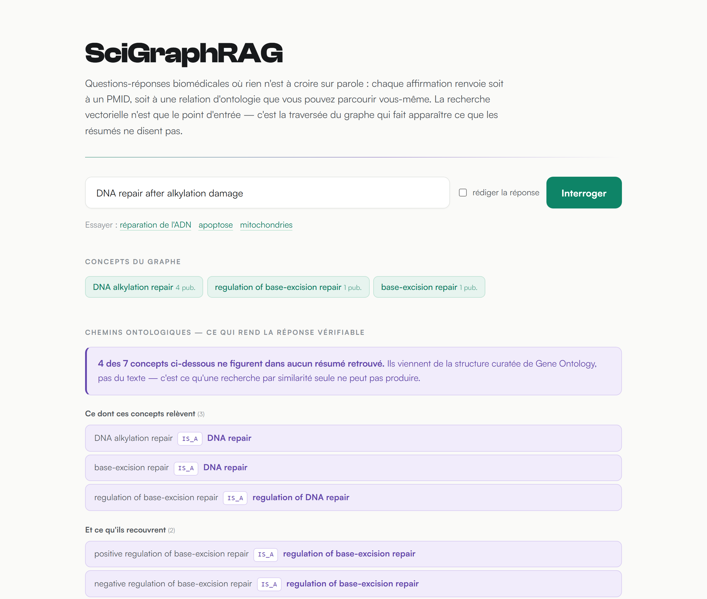
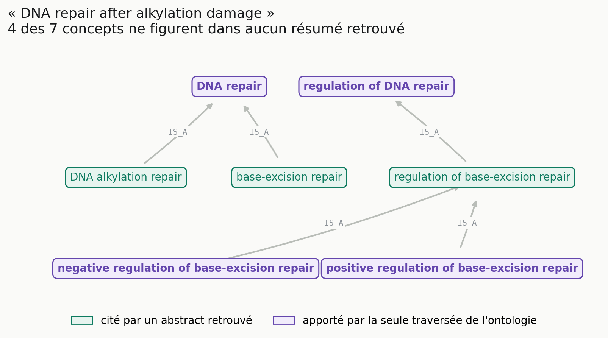
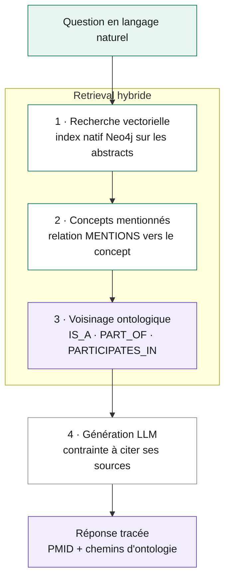

# SciGraphRAG

**GraphRAG biomédical explicable — chaque réponse est traçable jusqu'à un PMID ou une relation d'ontologie.**

[](https://www.python.org/)
[](https://neo4j.com/)
[](https://fastapi.tiangolo.com/)
[](tests/)
[](LICENSE)

Moteur de questions-réponses biomédicales adossé à un graphe de connaissances, conçu pour l'**explicabilité** : chaque réponse expose les concepts, les chemins ontologiques et les publications sur lesquels elle repose.

<picture>
  <source media="(prefers-color-scheme: dark)" srcset="docs/images/demo-sombre.png">
  
</picture>

<sub>La démo web, sur une vraie question. [Voir la page entière](docs/images/demo-complete.png) — publications et scores compris.</sub>

## Ce qui distingue ce projet d'un RAG classique

Un RAG ordinaire renvoie des extraits de texte proches sémantiquement, sans lien entre eux. Ici, la recherche vectorielle n'est que la première étape : le système remonte ensuite aux concepts mentionnés par les publications trouvées, puis explore leur voisinage dans l'ontologie.

**Ce que ça change, en une image** — sur la question *« DNA repair after alkylation damage »*, 4 des 7 concepts restitués n'apparaissent dans **aucun** des résumés retrouvés. Ils viennent de la structure curatée de Gene Ontology :



<sub>Figure reproductible : `PYTHONPATH=src python scripts/figure_apport_graphe.py`</sub>

En vert, ce qu'une recherche par similarité sait trouver. En violet, ce qu'elle ne peut pas produire — et c'est précisément ce qui rend la réponse vérifiable : l'utilisateur peut contrôler d'où vient chaque affirmation.

## Architecture du pipeline



Détail complet dans [docs/ARCHITECTURE.md](docs/ARCHITECTURE.md).

## Sources de données

| Source | Contenu | Accès |
|---|---|---|
| **Gene Ontology** | Processus biologiques, relations `IS_A` / `PART_OF` | OWL local (`go.owl`) |
| **Reactome** | Voies biologiques et protéines | BioPAX/OWL (`Homo_sapiens.owl`) |
| **PubMed** | Abstracts rattachés aux concepts | API NCBI E-utilities, publique |

L'accès PubMed respecte l'étiquette NCBI : identification par `tool`/`email`, cadence maintenue sous 3 requêtes/seconde.

## Statistiques du graphe

Chiffres vérifiés après import complet (reproductibles via `python scripts/report_full_counts.py`) :

| Élément | Nombre |
| --- | ---: |
| Nœuds totaux | 1 197 |
| Relations totales | 1 751 |
| BiologicalProcess | 94 |
| Protein | 249 |
| Publication | 834 |
| Pathway | 20 |
| PARTICIPATES_IN | 717 |
| MENTIONS | 928 |
| IS_A | 96 |
| PART_OF | 10 |

Les 834 publications proviennent d'un import des 114 concepts du graphe × 10 abstracts. Le script est relançable et n'encode que les publications nouvelles.

**Les termes GO dépréciés sont exclus.** Gene Ontology conserve ses termes obsolètes, libellés `obsolete ...` — ils représentaient 70 des 164 concepts initialement importés, soit 43 %. Ils sont écartés à l'extraction (`FILTER NOT EXISTS { ?term owl:deprecated true }`) pour deux raisons mesurées : ils sont **isolés dans la hiérarchie** — zéro relation `IS_A` ou `PART_OF` — donc n'apportent aucune explicabilité, et PubMed ne renvoie évidemment rien pour un libellé comme *« obsolete DNA ligation involved in DNA repair »*. Un graphe de 94 concepts vivants est plus utile que 164 dont 70 sont morts.

## Démarrage rapide

**1. Dépendances**

```bash
pip install -r requirements.txt
```

**2. Neo4j** — version 5.13 minimum (index vectoriel natif) :

```bash
docker run -d --name scigraph-neo4j \
  -p 7476:7474 -p 7689:7687 \
  -e NEO4J_AUTH=neo4j/scigraph123 \
  neo4j:5
```

**3. Configuration**

```bash
cp .env.example .env
# NEO4J_URI=bolt://localhost:7689
# NEO4J_USER=neo4j
# NEO4J_PASSWORD=scigraph123
```

**4. Construction du graphe**

```bash
python scripts/import_go.py            # ontologie Gene Ontology
python scripts/import_reactome.py      # voies et protéines Reactome
python scripts/import_pubmed.py --pubs 10                 # couche textuelle (~20 min)
python scripts/build_embeddings.py     # vecteurs + index
```

**5. Démonstration web**

```bash
PYTHONPATH=src uvicorn app.main:app --port 8000
```

Puis ouvrir <http://localhost:8000>.

## Génération de réponse rédigée (optionnelle)

Le pipeline fonctionne sans clé API : il affiche alors le contexte structuré sans rédaction. Pour activer la réponse en langage naturel :

```bash
pip install anthropic
echo "ANTHROPIC_API_KEY=sk-..." >> .env
```

Le prompt système impose la traçabilité : citer `[PMID xxxxx]` pour un fait issu de la littérature, nommer la relation ontologique pour un fait structurel, distinguer les deux, et conclure sur les limites du contexte.

## Structure du dépôt

```
src/
  ingest/pubmed.py        récupération des abstracts (API NCBI)
  kg/schema.py            contraintes et index Neo4j
  kg/embeddings.py        encodage local + index vectoriel
  kg/neo4j_client.py      client Neo4j
  reasoning/retrieval.py  retrieval hybride graphe + texte
  reasoning/generation.py construction du prompt et appel LLM
scripts/                  pipelines d'import et de vectorisation
  figure_apport_graphe.py figure du README : apport propre de l'ontologie
app/                      démonstration FastAPI (API + page unique)
docs/images/              captures et figures, régénérables
tests/                    calibration du seuil de pertinence (pytest)
```

## Tests

La calibration du détecteur de pertinence est vérifiée sur des scores réellement mesurés sur le corpus — jamais sur des fixtures inventées, une leçon apprise à ses dépens (voir « Choix techniques ») :

```bash
pytest tests/
```

Chaque module de `src/` embarque en complément un `_demo()` exécutable qui échoue si la logique casse. Ils nécessitent Neo4j en marche (sauf `ingest.pubmed`, qui appelle l'API NCBI, et `kg.embeddings`, hors ligne) :

```bash
PYTHONPATH=src python -m ingest.pubmed
PYTHONPATH=src python -m kg.embeddings
PYTHONPATH=src python -m reasoning.retrieval
PYTHONPATH=src python -m reasoning.generation
```

## Exemples de requêtes Cypher

**Publications rattachées à un concept, avec sa hiérarchie**

```cypher
MATCH (pub:Publication)-[:MENTIONS]->(c:BiologicalProcess)
OPTIONAL MATCH (c)-[:IS_A|PART_OF]->(parent:BiologicalProcess)
RETURN c.label AS concept, count(DISTINCT pub) AS publications,
       collect(DISTINCT parent.label) AS parents
ORDER BY publications DESC LIMIT 10
```

**Recherche vectorielle croisée avec le graphe**

```cypher
CALL db.index.vector.queryNodes('publication_embeddings', 5, $vecteur)
YIELD node AS pub, score
MATCH (pub)-[:MENTIONS]->(c)
RETURN pub.pmid, pub.title, score, collect(coalesce(c.label, c.name)) AS concepts
ORDER BY score DESC
```

**Protéines d'une voie biologique**

```cypher
MATCH (p:Protein)-[:PARTICIPATES_IN]->(pw:Pathway)
RETURN pw.name AS pathway, collect(p.name)[0..10] AS proteines, count(p) AS total
ORDER BY total DESC
```

## Choix techniques

**Index vectoriel natif Neo4j plutôt qu'une base vectorielle séparée.** Les vecteurs sont stockés sur les nœuds `:Publication`, ce qui permet de combiner filtrage structurel Cypher et similarité sémantique dans une même requête — l'intérêt même d'un GraphRAG.

**Embeddings locaux multilingues (`intfloat/multilingual-e5-large`, 1024 dimensions).** Aucun service externe : quiconque clone le dépôt reproduit les résultats. Le modèle initial (`all-MiniLM-L6-v2`, 384 dimensions, ~80 Mo) était plus léger et meilleur en anglais, mais traitait le français comme du bruit — mesuré sur une question pertinente : **0,184 en français contre 0,795 pour la même question en anglais**. Inacceptable pour un projet francophone. Avec e5, le français remonte à 0,878.

Le prix à payer est assumé : e5-large pèse ~2,2 Go au lieu de 80 Mo. `multilingual-e5-base` (768 dim) ou `-small` (384 dim) sont 3 à 5 fois plus légers pour une qualité proche — il faut alors ajuster `DIMENSIONS` et recréer l'index (`build_embeddings.py --reinitialiser`). Les modèles E5 exigent par ailleurs les préfixes `query: ` et `passage: ` : sans eux la qualité chute nettement.

**Détection de non-couverture par seuil absolu.** Un système qui répond toujours, même quand le corpus ne contient rien, présente le bruit le mieux classé comme une réponse. `resultats_pertinents()` tranche donc sur le meilleur score : au-dessus de **0,90**, le corpus couvre la question.

Ce seuil vient d'une mesure, pas d'une intuition — et une première version reposait sur un critère différent (l'écart entre le meilleur score et la moyenne) qui s'est révélé inopérant. L'index vectoriel renvoie les *k* voisins les plus proches, qui se ressemblent donc entre eux quelle que soit la question : cet écart vaut ~0,005 aussi bien pour « apoptosis regulation » que pour « recette de pizza ». Le niveau absolu, lui, sépare franchement : questions couvertes ≥ 0,9209, questions hors sujet ≤ 0,8903. La calibration est vérifiée sur 20 distributions réelles dans `tests/test_pertinence.py`.

La séparation a résisté au doublement du corpus (428 → 834 publications) : les deux populations ont glissé d'environ 0,002 vers le haut, et la marge est passée de 0,0299 à 0,0306. Le cas le plus serré est instructif — « comment réparer une voiture » atteint 0,8903, le plus haut score hors sujet, parce qu'en français « réparer » partage sa sémantique avec les nombreux concepts de *DNA repair* du corpus.

**Déduplication par PMID.** Une publication citée par plusieurs concepts n'est stockée qu'une fois ; les publications sans abstract sont écartées à l'ingestion, faute d'apporter quoi que ce soit au retrieval.

**Scripts relançables.** Seules les publications non encore encodées sont traitées, ce qui permet d'élargir la couverture progressivement.

## Limites connues

- Les 114 concepts du graphe ont tous été interrogés, mais 14 ne renvoient rien : **100 concepts sur 114 sont documentés**. Les 14 restants portent des libellés trop spécifiques pour une recherche PubMed par mots-clés — 7 processus GO du type *symbiont-mediated suppression of host apoptosis*, et 7 voies Reactome très granulaires sur le trafic ciliaire (*VxPx cargo-targeting to cilium*).
- L'ingestion ne récupère que titre et résumé. Les résultats chiffrés d'une étude — tailles d'effet, intervalles de confiance — vivent dans le texte intégral et échappent donc au retrieval.
- Le modèle d'embedding est généraliste, non spécialisé sur le vocabulaire biomédical.
- Le seuil de pertinence (0,90) dépend de ce corpus **et** de ce modèle. Un import PubMed élargi ou un changement d'embedding déplacera la frontière : il faut remesurer. `test_la_separation_reste_franche` détecte la dérive mais ne recalibre pas.
- L'appel LLM n'est pas couvert par les tests automatiques : le `_demo()` de `generation.py` valide la construction du prompt sans requête réseau.
- La traversée du graphe s'exécute avant le verdict de pertinence : une question hors sujet remonte donc quand même des chemins ontologiques, sous l'avertissement qui les signale comme non fiables.
- Reactome n'est chargé que pour *Homo sapiens*.

## Technologies

Python 3.13 · Neo4j 5.26 · rdflib · SPARQL · Cypher · sentence-transformers · FastAPI · NetworkX · Pandas

## Auteur / Licence

- Auteur : Toufic Bathich — <toufic.bathich123@gmail.com>
- Licence : MIT

## Citation

> SciGraphRAG — Bathich, Toufic. Sources : Gene Ontology (`go.owl`), Reactome (`Homo_sapiens.owl`), PubMed (NCBI E-utilities).
