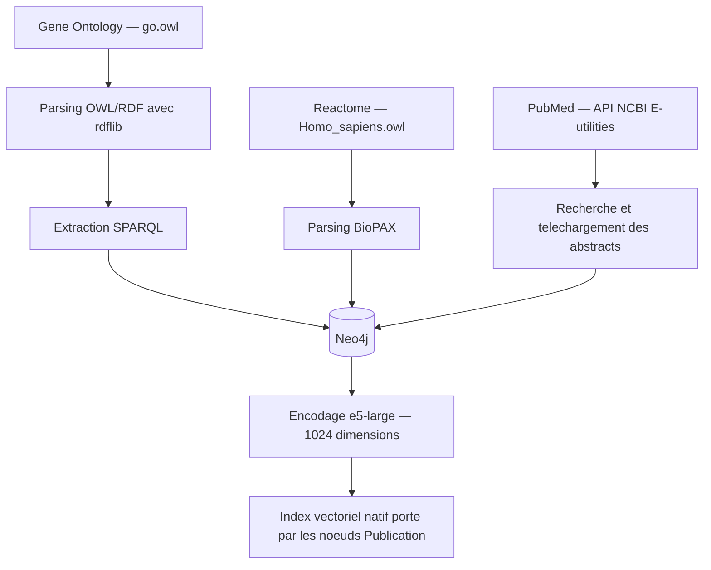
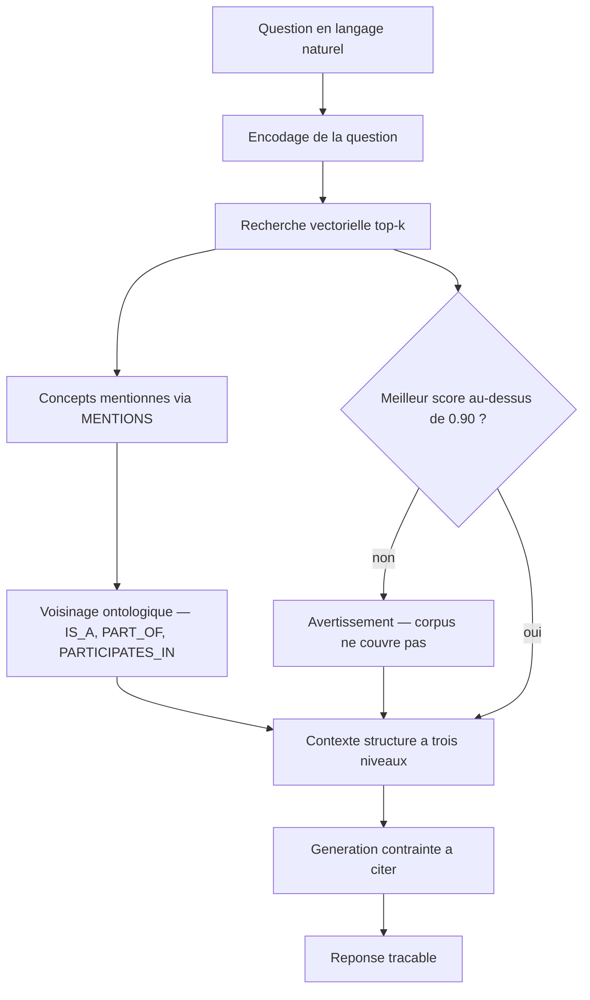

# Architecture

Le projet se lit en deux temps : la **construction** du graphe, faite une fois par
des scripts relançables, et l'**interrogation**, qui s'exécute à chaque question.

## 1. Construction du graphe

| Étape | Script | Produit |
|---|---|---|
| Ontologie | `scripts/import_go.py` | `:BiologicalProcess`, `IS_A`, `PART_OF` |
| Voies et protéines | `scripts/import_reactome.py` | `:Pathway`, `:Protein`, `PARTICIPATES_IN` |
| Couche textuelle | `scripts/import_pubmed.py` | `:Publication`, `MENTIONS` |
| Couche vectorielle | `scripts/build_embeddings.py` | `embedding` sur `:Publication` + index |

Les vecteurs sont portés par les nœuds eux-mêmes : pas de base vectorielle
séparée, donc filtrage structurel Cypher et similarité sémantique se combinent
dans une même requête.

## 2. Interrogation — le pipeline GraphRAG

| Étape | Module | Rôle |
|---|---|---|
| 1 · Recherche vectorielle | `kg/embeddings.py` | Publications sémantiquement proches |
| 2 · Concepts | `reasoning/retrieval.py` | Ce dont parlent ces publications |
| 3 · Voisinage ontologique | `reasoning/retrieval.py` | La structure curatée autour d'eux |
| 4 · Génération | `reasoning/generation.py` | Rédaction contrainte à citer ses sources |

## Lecture du schéma

- `Gene Ontology` est analysée comme ressource `OWL/RDF` avec `rdflib` ; les
  triplets utiles sont extraits par `SPARQL` avant import dans `Neo4j`.
- `Reactome` complète le graphe avec les voies biologiques et les protéines.
- `PubMed` ajoute la couche textuelle qui rend le retrieval possible : chaque
  abstract est relié par `MENTIONS` au concept qui a servi à le trouver.
- À l'interrogation, la recherche vectorielle n'est que la **première** étape.
  Ce qui distingue ce pipeline d'un RAG ordinaire, ce sont les étapes 2 et 3 :
  elles produisent des chemins comme
  `DNA alkylation repair --IS_A--> DNA repair`, absents de tout abstract et
  vérifiables indépendamment de ce que rédige le modèle de langage.
- Le test de seuil ne bloque pas la réponse : il l'accompagne d'un avertissement.
  Distinguer « pas de réponse » de « des résultats sans rapport » évite que
  l'outil présente le bruit le mieux classé comme une réponse. La calibration de
  ce seuil est documentée dans le README et vérifiée par `tests/test_pertinence.py`.

## Restitution

- `app/` — démonstration FastAPI : une page unique qui expose les trois niveaux
  du contexte, pour rendre visible *sur quoi* repose la réponse.
- `examples/demo_notebook.ipynb` — exploration du graphe et visualisation de
  sous-graphes avec `networkx` et `matplotlib`.
